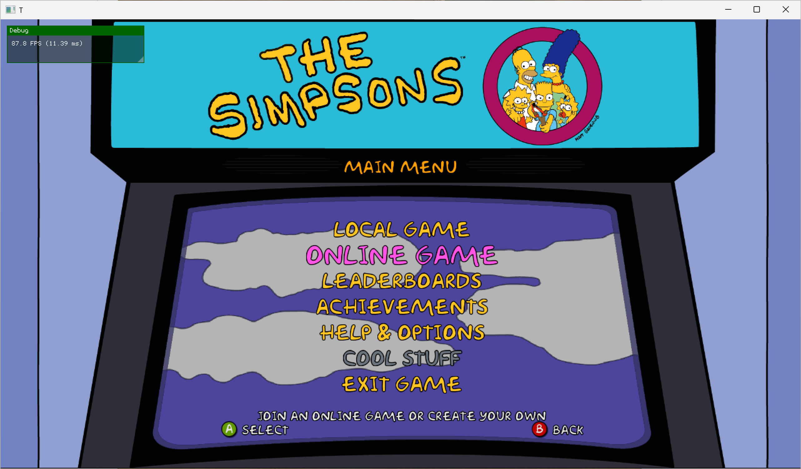
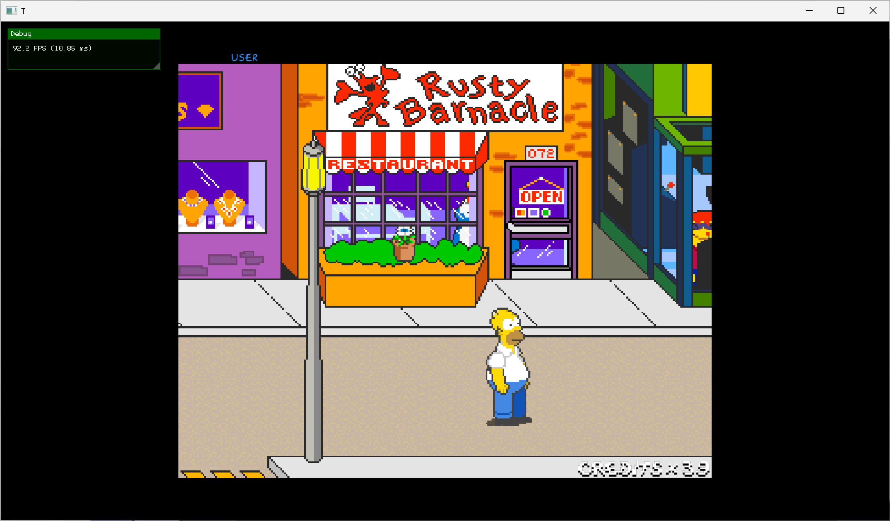

# The Simpsons Arcade - Static Recompilation

A static recompilation of **The Simpsons Arcade** (Xbox 360 / XBLA) to native x86-64 PC using [XenonRecomp](https://github.com/hedge-dev/XenonRecomp) and the [ReXGlue SDK](https://github.com/hedge-dev/ReXGlue).

**The game is playable at full speed** — boots through menus, renders gameplay, audio playing, keyboard and controller input working.

## Screenshots





## Status

| Milestone | Status |
|-----------|--------|
| Repository scaffolding | Done |
| XEX extraction & PE analysis | Done |
| ABI address detection | Done |
| XenonRecomp pass (15,237 functions) | Done |
| Jump table analysis & switch tables (23/29 fixed) | Done |
| Runtime skeleton & ReXGlue SDK integration | Done |
| PE image loading & data sections | Done |
| Xbox 360 kernel import stubs | Done |
| Graphics (Xenos -> D3D12/Vulkan via ReXGlue) | Done |
| Audio (XMA2 via ReXGlue) | Done |
| Input (SDL GameController + Keyboard) | Done |
| Crash logging & VEH handler | Done |
| Speed fix (VdSwap frame limiter + timebase scaling) | Done |
| Menu system & settings (ImGui + Win32 menu bar) | Done |
| Keyboard-to-gamepad input driver | Done |
| Game unlocks (levels, ROMs, cool stuff) | In Progress — achievement overrides working, investigating save/progress system |
| Network (LAN multiplayer) | Not Started |
| Polish & optimization | Not Started |

## Game Information

- **Title:** The Simpsons Arcade
- **Title ID:** 0x584111FA
- **Developer:** Backbone Entertainment / Konami
- **Publisher:** Konami
- **Release:** February 2012 (XBLA)
- **Genre:** Beat 'em up arcade port (original 1991 Konami arcade)
- **Players:** 1-4 (local co-op)

## Repository Structure

```
simpsonsarcade/
├── config/                        # XenonRecomp configuration
│   ├── simpsons.toml              # Main recomp config (ABI addresses, functions)
│   ├── simpsons_switch_tables.toml # Jump table definitions (23 tables)
│   ├── simpsons_switch_tables_gen.toml # Auto-generated switch tables
│   ├── simpsons_switch_tables_new.toml # Additional switch tables
│   └── simpsons_rexglue.toml      # ReXGlue SDK configuration
├── scripts/                       # Utility scripts
│   └── extract_switch_tables.py   # Auto-extract jump tables from PE binary
├── project/                       # Runtime implementation
│   ├── CMakeLists.txt             # Build configuration (Clang + Ninja)
│   ├── CMakePresets.json          # CMake presets
│   ├── src/
│   │   ├── main.cpp               # SimpsonsApp: window, graphics, crash logging
│   │   ├── stubs.cpp              # Game-specific Xbox 360 API stubs
│   │   ├── simpsons_settings.h/cpp # Settings persistence (TOML)
│   │   ├── simpsons_menu.h/cpp    # Menu bar & ImGui config dialogs
│   │   ├── keyboard_driver.h/cpp  # Keyboard-to-gamepad input driver
│   │   └── test_boot.cpp          # Console test harness
│   └── out/                       # CMake build output
├── src/                           # Generic runtime source (shared with SDK)
│   ├── kernel_stubs.cpp           # Comprehensive Xbox 360 API stubs
│   ├── memory.cpp/h               # 4GB PPC memory space
│   ├── xex_loader.cpp/h           # PE image data section loader
│   └── math_polyfill.cpp          # C23 math polyfills
├── generated/                     # XenonRecomp output (auto-generated)
├── ppc/                           # Recompiled PPC -> C++ (58 source files, ~45 MB)
├── extracted/                     # Game assets (gitignored, user-provided)
├── docs/                          # Documentation and research notes
├── images/                        # Screenshots for README
├── tools/                         # Toolchain (gitignored, built locally)
│   └── rexglue-sdk/               # ReXGlue SDK installation
├── PROGRESS.md                    # Detailed phase-by-phase progress
└── README.md                      # This file
```

## Prerequisites

- **CMake 3.25+**
- **Clang 18+** (LLVM toolchain)
- **Ninja** build system
- **Python 3.8+** (for switch table extraction)
- **ReXGlue SDK** (set `REXSDK` environment variable or place in `tools/rexglue-sdk/`)
- A legally obtained copy of **The Simpsons Arcade** XEX

## Quick Start

```bash
# 1. Clone this repo
git clone https://github.com/sp00nznet/simpsonsarcade.git
cd simpsonsarcade

# 2. Place your extracted game files in extracted/
#    - extracted/default.xex (Xbox 360 executable)
#    - extracted/584111FA/   (game assets)

# 3. Run XenonRecomp to generate PPC -> C++ code
cd config
XenonRecomp simpsons.toml ../ppc/ppc_context.h
cd ..

# 4. Configure and build
cd project
cmake --preset win-amd64    # or: cmake -B out -G Ninja
cmake --build out

# 5. Run
./out/simpsons.exe "../../extracted"
```

## How It Works

Unlike emulation (which interprets instructions at runtime), static recompilation translates the entire PowerPC binary ahead of time into equivalent C++ source code. Each PPC instruction maps to C++ code operating on a CPU state struct. The result is a native executable that runs at full speed without an emulator.

The ReXGlue SDK provides the runtime environment: Xbox 360 kernel emulation, graphics translation (Xenos GPU -> D3D12/Vulkan), audio (XMA2 decoding), input (SDL GameController -> XInput mapping), and memory management.

### Speed Fix

The game originally ran at half speed (~30 FPS game logic) despite reporting ~70 FPS. Two fixes were needed:

1. **VdSwap frame limiter** — The `Sleep(16)` in VdSwap actually sleeps ~31ms on Windows (15.6ms timer granularity). Replaced with a precise `QueryPerformanceCounter` frame limiter targeting 16.667ms.
2. **Timebase scaling** — XenonRecomp generates `__rdtsc()` for PPC `mftb` instructions, but host TSC runs at ~3-4 GHz vs Xbox 360's 49.875 MHz. Overridden to route through the SDK's scaled guest timebase.

See [docs/speed-fix.md](docs/speed-fix.md) for full details and instructions for porting to other projects.

## References

- [UnleashedRecomp](https://github.com/hedge-dev/UnleashedRecomp) — Sonic Unleashed recomp (reference project)
- [vig8](https://github.com/sp00nznet/vig8) — Vigilante 8 Arcade recomp (sister project)
- [XenonRecomp](https://github.com/hedge-dev/XenonRecomp) — Xbox 360 static recompiler
- [ReXGlue](https://github.com/hedge-dev/ReXGlue) — Runtime SDK for recompiled Xbox 360 games
- [N64: Recompiled](https://github.com/N64Recomp/N64Recomp) — Inspiration for the approach

## License

This project contains no copyrighted game assets. You must provide your own legally obtained copy of The Simpsons Arcade.
